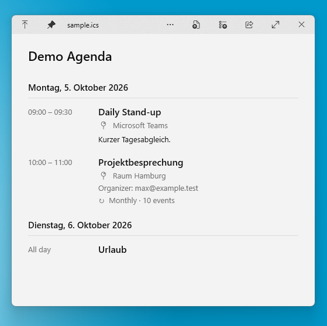

# QuickLook ICS Agenda

[](https://github.com/eriwst/QuickLook.Plugin.IcsAgenda/releases/latest)
[](LICENSE)

A lightweight plugin for [QuickLook](https://github.com/QL-Win/QuickLook) that previews `.ics` / iCalendar files as a clean, compact agenda.



> **AI-assisted development:** This project was developed with extensive assistance from **OpenAI's ChatGPT**. Significant parts of the source code and documentation were AI-generated. The repository owner provided the project idea, requirements, testing, feedback, and design/release decisions.

## Download & install

**[Download the latest release](https://github.com/eriwst/QuickLook.Plugin.IcsAgenda/releases/latest)**

For normal use, **you do not need to build anything**.

1. Open the latest release using the link above.
2. Download **`QuickLook.Plugin.IcsAgenda.qlplugin`** from the release assets.
3. Make sure QuickLook is running.
4. Select the downloaded `.qlplugin` file in Windows Explorer and press **Space**.
5. Choose **Install**.
6. Restart QuickLook.
7. Select any `.ics` file and press **Space**.

> Do not download GitHub's automatically generated **Source code (zip)** unless you want to build the plugin yourself.

## Features

- Agenda-style preview for `.ics` / iCalendar files
- Multiple events sorted chronologically and grouped by day
- All-day events
- Start and end times
- Location, organizer, and description
- Human-readable recurrence summaries
- UTF-8 and RFC 5545 folded-line handling
- Local conversion for UTC (`Z`) timestamps

## Recurring events

Recurring events are intentionally displayed **once** rather than expanded into all future occurrences. QuickLook is meant to provide a fast preview, not act as a full calendar application.

The recurrence rule is summarized directly in the agenda, for example:

```text
↻ Monthly · 10 events
↻ Every 2 weeks · Mon, Wed
↻ Daily · until 31 Dec 2026
```

The preview understands `FREQ`, `INTERVAL`, `COUNT`, `BYDAY`, and `UNTIL` for these summaries.

## Known limitations

- `TZID` / `VTIMEZONE` definitions are not fully resolved yet.
- Floating/TZID timestamps are currently displayed using their wall-clock value.
- Recurrence rules are summarized but deliberately not expanded into separate occurrences.
- The viewer is intended as a preview, not as a complete RFC 5545 calendar implementation.

## Build from source

### Requirements

- QuickLook for Windows
- .NET 8 SDK
- .NET Framework 4.6.2 Developer Pack
- A compatible `QuickLook.Common.dll` from your QuickLook installation

Install the required SDK and Developer Pack with `winget`:

```powershell
winget install Microsoft.DotNet.SDK.8
winget install Microsoft.DotNet.Framework.DeveloperPack.4.6
```

Create a local `lib` directory and copy a compatible QuickLook assembly to:

```text
lib\QuickLook.Common.dll
```

`QuickLook.Common.dll` is **not** distributed with this repository. Obtain a compatible copy from your local QuickLook installation.

Then build and package the plugin:

```powershell
dotnet clean
dotnet restore
dotnet build -c Release
powershell -ExecutionPolicy Bypass -File .\Scripts\pack-zip.ps1
```

The resulting package is:

```text
QuickLook.Plugin.IcsAgenda.qlplugin
```

For release-maintainer instructions, see [`RELEASING.md`](RELEASING.md).

## License

This project is released under the MIT License. See [`LICENSE`](LICENSE).
